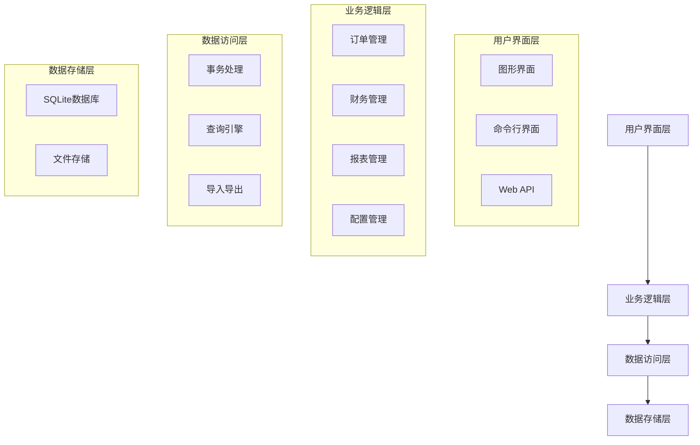
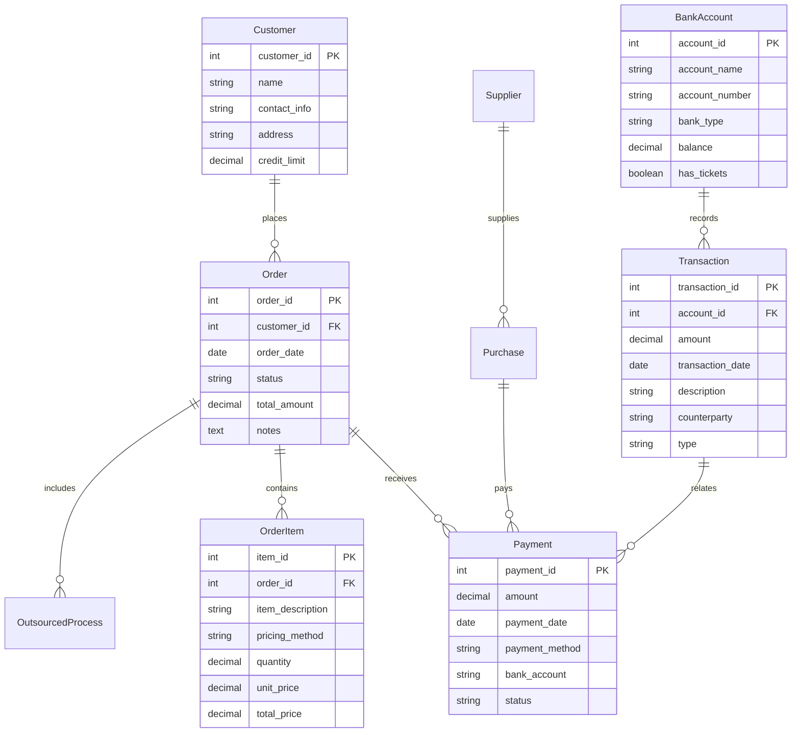

# 设计文档

## 概述

氧化加工厂财务管理系统是一个专门为小型氧化加工企业设计的财务管理解决方案。系统采用模块化架构，以简单易用为核心设计原则，支持氧化加工行业的特殊业务需求，包括多样化计价方式、灵活的收付款管理和专业的成本控制。

## 架构

系统采用分层架构设计，包含以下主要层次：



## 组件和接口

### 1. 订单管理组件 (OrderManager)

负责氧化加工订单的全生命周期管理。

**主要接口:**
- `create_order(customer_info, items, pricing_method)`: 创建新订单
- `update_order_status(order_id, status)`: 更新订单状态
- `calculate_processing_fee(order_id)`: 计算加工费用
- `get_order_by_id(order_id)`: 获取订单详情
- `list_orders(filters)`: 查询订单列表

**关键功能:**
- 支持七种计价方式（件、条、只、个、米、公斤、平方米）
- 工序状态跟踪（喷砂、拉丝、抛光、氧化）
- 委外加工管理
- 自动费用计算

### 2. 财务管理组件 (FinanceManager)

处理收入、支出和银行账户管理。

**主要接口:**
- `record_income(amount, source, bank_account, date)`: 记录收入
- `record_expense(amount, category, supplier, date)`: 记录支出
- `allocate_payment(payment_id, order_ids, amounts)`: 分配付款
- `get_account_balance(bank_account)`: 获取账户余额
- `reconcile_bank_statement(statement_data)`: 银行对账

**关键功能:**
- G银行和N银行分别管理
- 灵活的收付款分配
- 十种支出类型分类
- 实际发生制记账

### 3. 报表管理组件 (ReportManager)

生成各类财务报表和业务分析报告。

**主要接口:**
- `generate_balance_sheet(period)`: 生成资产负债表
- `generate_income_statement(period)`: 生成利润表
- `generate_cash_flow_statement(period)`: 生成现金流量表
- `generate_business_analysis(period)`: 生成业务分析报告
- `export_report(report_type, format)`: 导出报表

**关键功能:**
- 标准财务报表自动生成
- 业务分析和可视化图表
- 多种导出格式支持
- 模板和示例数据

### 4. 数据导入导出组件 (DataManager)

处理外部数据的导入导出和系统集成。

**主要接口:**
- `import_bank_statement(file_path, bank_type)`: 导入银行流水
- `export_financial_data(format, period)`: 导出财务数据
- `backup_system_data()`: 备份系统数据
- `restore_system_data(backup_file)`: 恢复系统数据
- `validate_import_data(data)`: 验证导入数据

**关键功能:**
- Excel格式支持
- 自动数据匹配
- 数据完整性验证
- 备份恢复机制

### 5. 配置管理组件 (ConfigManager)

管理系统配置和基础数据维护。

**主要接口:**
- `manage_customers(action, customer_data)`: 客户信息管理
- `manage_suppliers(action, supplier_data)`: 供应商信息管理
- `configure_pricing_methods(methods)`: 配置计价方式
- `configure_account_structure(accounts)`: 配置会计科目
- `manage_user_permissions(user_id, permissions)`: 用户权限管理

**关键功能:**
- 基础数据维护
- 系统参数配置
- 用户权限控制
- 操作日志记录

## 数据模型

### 核心实体关系图



### 主要数据结构

**订单数据结构:**
```python
class Order:
    order_id: int
    customer_id: int
    order_date: date
    items: List[OrderItem]
    total_amount: Decimal
    status: OrderStatus
    processes: List[ProcessStep]
    outsourced_processes: List[OutsourcedProcess]
```

**计价方式枚举:**
```python
class PricingMethod(Enum):
    PER_PIECE = "件"      # 按件计价
    PER_STRIP = "条"      # 按条计价
    PER_UNIT = "只"       # 按只计价
    PER_ITEM = "个"       # 按个计价
    PER_METER = "米"      # 按米长计价
    PER_KILOGRAM = "公斤"  # 按米重计价
    PER_SQUARE_METER = "平方米"  # 按平方计价
```

**支出类型枚举:**
```python
class ExpenseCategory(Enum):
    RENT = "房租"
    UTILITIES = "水电费"
    ACIDS = "三酸"          # 硫酸、硝酸、盐酸
    ALKALI = "片碱、亚钠"
    COLOR_POWDER = "色粉"
    DEGREASER = "除油剂"
    FIXTURES = "挂具"
    OUTSOURCING = "外发加工费用"
    DAILY_EXPENSES = "日常费用支出"
    WAGES = "工资"
```

## 错误处理

系统采用分层错误处理策略：

### 1. 业务逻辑错误
- 订单状态不一致
- 计价方式不匹配
- 余额不足
- 数据完整性约束违反

### 2. 数据访问错误
- 数据库连接失败
- 查询超时
- 数据格式错误
- 文件访问权限问题

### 3. 用户输入错误
- 必填字段缺失
- 数据格式不正确
- 数值范围超限
- 重复数据提交

### 4. 系统级错误
- 内存不足
- 磁盘空间不足
- 网络连接问题
- 权限不足

**错误处理原则:**
- 用户友好的错误消息
- 详细的错误日志记录
- 自动错误恢复机制
- 数据一致性保护

## 测试策略

### 单元测试
- 每个组件的核心功能测试
- 边界条件和异常情况测试
- 数据验证逻辑测试
- 计算逻辑准确性测试

### 集成测试
- 组件间接口测试
- 数据流完整性测试
- 事务处理测试
- 外部系统集成测试

### 用户验收测试
- 典型业务场景测试
- 用户界面易用性测试
- 性能和响应时间测试
- 数据导入导出测试

## 正确性属性

*属性是一个特征或行为，应该在系统的所有有效执行中保持为真——本质上是关于系统应该做什么的正式陈述。属性作为人类可读规范和机器可验证正确性保证之间的桥梁。*

基于需求分析，以下是系统的核心正确性属性：

### 属性 1: 订单信息完整性
*对于任何*订单创建请求，包含客户信息、物品描述、工序要求和计价方式的订单，创建后查询该订单应该返回所有原始信息
**验证: 需求 1.1**

### 属性 2: 计价方式支持完整性
*对于任何*七种预定义计价方式（件、条、只、个、米、公斤、平方米），系统都应该能够正确处理和应用该计价方式
**验证: 需求 1.2**

### 属性 3: 委外加工信息关联性
*对于任何*包含委外加工的订单，委外供应商和费用信息应该与订单正确关联，并且能够通过订单查询到完整的委外信息
**验证: 需求 1.3, 3.3**

### 属性 4: 费用计算准确性
*对于任何*完成的订单，自动计算的总加工费用应该等于所有订单项目费用和委外加工费用的总和
**验证: 需求 1.4**

### 属性 5: 订单状态跟踪完整性
*对于任何*订单，从创建到完工的每个工序状态变更都应该被记录，并且状态变更序列应该符合业务流程规则
**验证: 需求 1.5**

### 属性 6: 付款信息记录完整性
*对于任何*客户付款，记录的付款金额、付款方式和付款日期应该与实际付款信息完全一致
**验证: 需求 2.1**

### 属性 7: 付款灵活分配一致性
*对于任何*付款分配操作，分配到各个订单或采购记录的金额总和应该等于原始付款金额，且不能超过各项的未付余额
**验证: 需求 2.2, 3.4**

### 属性 8: 银行账户类型识别准确性
*对于任何*收入记录，G银行交易应该正确标记票据信息，N银行交易应该被标记为现金等价物
**验证: 需求 2.3, 4.2, 4.3**

### 属性 9: 部分付款余额计算准确性
*对于任何*订单的部分付款，订单的未付余额应该等于订单总金额减去所有已付金额的总和
**验证: 需求 2.4**

### 属性 10: 支出分类管理完整性
*对于任何*支出记录，都应该能够正确分类到十种预定义支出类型中的一种，并且分类信息应该在查询时保持一致
**验证: 需求 3.1**

### 属性 11: 专业原料识别准确性
*对于任何*专业原料采购（三酸、片碱、亚钠、色粉、除油剂），系统应该正确识别原料类型并应用相应的管理规则
**验证: 需求 3.2**

### 属性 12: 银行账户独立管理
*对于任何*银行交易，G银行和N银行的账户余额和交易记录应该完全独立，一个账户的操作不应影响另一个账户
**验证: 需求 4.1**

### 属性 13: 银行流水导入匹配准确性
*对于任何*导入的银行流水数据，自动匹配的交易对手应该基于历史数据和匹配规则，匹配结果应该是确定性的
**验证: 需求 4.4, 8.2**

### 属性 14: 财务报表数据一致性
*对于任何*会计期间，资产负债表、利润表和现金流量表之间的数据应该保持会计恒等式的一致性
**验证: 需求 5.1**

### 属性 15: 报表周期数据准确性
*对于任何*指定的会计期间（月度、季度、年度），生成的报表数据应该只包含该期间内的交易，且数据完整无遗漏
**验证: 需求 5.3**

### 属性 16: 实际发生制记账时间准确性
*对于任何*业务交易，记录的交易日期应该是业务实际发生的日期，而不是系统录入日期
**验证: 需求 6.1**

### 属性 17: 收支匹配灵活性
*对于任何*收入和支出的匹配操作，系统应该支持多对多的匹配关系，且匹配后的金额分配应该保持数学一致性
**验证: 需求 6.2**

### 属性 18: 预收预付款时间差异处理
*对于任何*预收或预付款，系统应该正确处理收付款日期与业务发生日期的差异，确保会计期间归属正确
**验证: 需求 6.3**

### 属性 19: 审计轨迹完整性
*对于任何*业务操作，系统应该记录完整的操作轨迹，包括操作人、操作时间、操作内容和操作结果
**验证: 需求 6.4**

### 属性 20: 批量处理数据一致性
*对于任何*批量操作，批量处理的结果应该与逐个处理的结果完全一致，且操作应该是原子性的
**验证: 需求 7.4**

### 属性 21: Excel导入导出往返一致性
*对于任何*财务数据，导出为Excel格式后再导入，应该得到与原始数据完全一致的结果
**验证: 需求 8.1, 8.3**

### 属性 22: 数据备份往返一致性
*对于任何*系统数据和参数，备份后恢复应该得到与备份前完全一致的数据状态
**验证: 需求 8.4, 10.5**

### 属性 23: 数据验证规则一致性
*对于任何*导入的数据，验证规则应该一致地应用，相同的数据错误应该产生相同的验证结果
**验证: 需求 8.5**

### 属性 24: 业务分析数据准确性
*对于任何*业务分析报告，分析结果应该基于完整的业务数据，且计算逻辑应该是可重现的
**验证: 需求 9.1, 9.2, 9.3, 9.4**

### 属性 25: 配置管理数据完整性
*对于任何*系统配置操作，配置的增删改查应该保持数据完整性，且配置变更应该立即生效
**验证: 需求 10.1, 10.2, 10.3**

### 属性 26: 权限控制有效性
*对于任何*用户操作，系统应该根据用户权限正确允许或拒绝操作，且权限检查应该在每次操作时执行
**验证: 需求 10.4**

**测试配置:**
- 使用模拟数据进行测试
- 每个属性测试运行最少100次迭代
- 测试覆盖率要求达到90%以上
- 自动化测试集成到构建流程
- 每个属性测试必须标记对应的设计文档属性编号