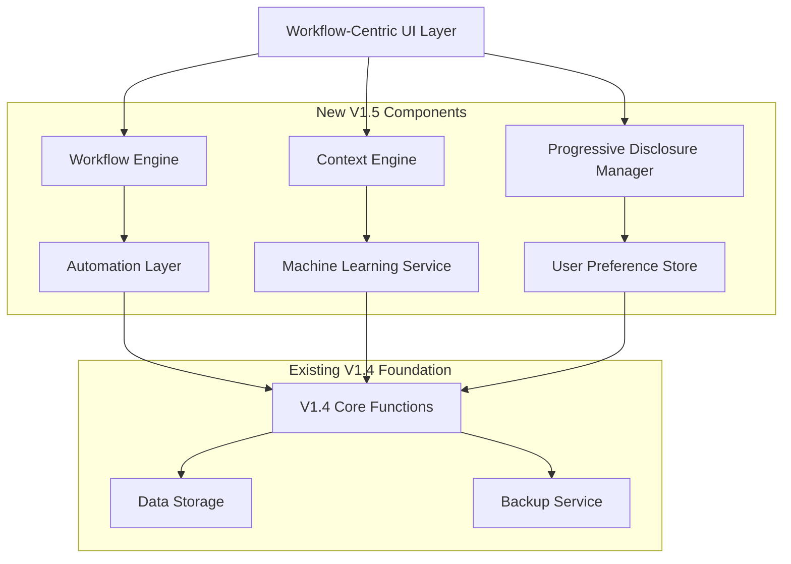
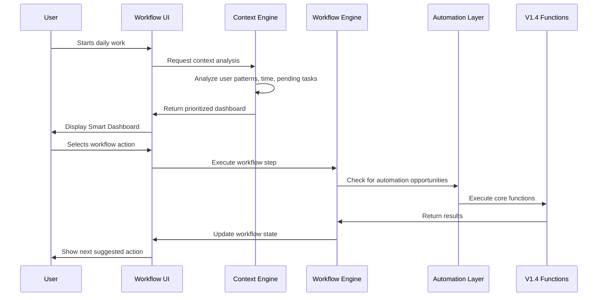

# Design Document

## Overview

The V1.5 Small Accountant Workflow Optimization transforms the existing 62-function Oxidation Factory Financial Assistant into an intelligent, workflow-centric system specifically designed for small business accountants. The design prioritizes cognitive load reduction, context awareness, and workflow automation to create a personal assistant experience rather than a traditional software tool.

The system employs adaptive interface patterns, progressive disclosure, and machine learning to understand user patterns and provide intelligent assistance. The architecture supports both the existing V1.4 functionality while introducing new workflow-centric layers that simplify and streamline the user experience.

## Architecture

### High-Level Architecture



### Component Interaction Flow



## Components and Interfaces

### 1. Workflow Engine

**Purpose**: Orchestrates multi-step financial processes and maintains workflow state.

**Key Interfaces**:
```python
class WorkflowEngine:
    def start_workflow(self, workflow_type: str, context: dict) -> WorkflowSession
    def execute_step(self, session_id: str, step_data: dict) -> StepResult
    def get_next_suggestions(self, session_id: str) -> List[WorkflowAction]
    def save_workflow_state(self, session_id: str) -> bool
    def get_workflow_templates(self, user_patterns: dict) -> List[WorkflowTemplate]
```

**Workflow Types**:
- Morning Setup: Daily priority review, pending task check, system status
- Transaction Entry: Smart entry with context-aware defaults
- End-of-Day: Summary generation, backup verification, tomorrow's preparation
- Monthly Close: Automated report generation, reconciliation, compliance checks

### 2. Context Engine

**Purpose**: Analyzes user behavior, business patterns, and current state to provide intelligent assistance.

**Key Interfaces**:
```python
class ContextEngine:
    def analyze_current_context(self, user_id: str) -> ContextAnalysis
    def predict_next_action(self, current_state: dict) -> List[PredictedAction]
    def generate_smart_defaults(self, transaction_type: str, context: dict) -> dict
    def learn_from_correction(self, prediction: dict, actual: dict) -> None
    def get_personalized_dashboard(self, user_id: str, time_context: str) -> Dashboard
```

**Context Factors**:
- Time of day and business cycles
- Recent user actions and patterns
- Pending tasks and deadlines
- Historical transaction patterns
- Customer/vendor interaction history

### 3. Progressive Disclosure Manager

**Purpose**: Controls information presentation to minimize cognitive load while maintaining access to advanced features.

**Key Interfaces**:
```python
class ProgressiveDisclosureManager:
    def get_primary_actions(self, context: str, max_items: int = 5) -> List[Action]
    def get_secondary_actions(self, context: str) -> List[Action]
    def should_show_advanced_feature(self, feature: str, user_level: str) -> bool
    def adapt_menu_priority(self, user_patterns: dict) -> MenuConfiguration
    def provide_contextual_help(self, current_action: str) -> HelpContent
```

**Disclosure Levels**:
- **Primary**: 5 most relevant actions based on context
- **Secondary**: Additional actions revealed on demand
- **Advanced**: Expert features shown only when explicitly requested
- **Contextual**: Help and guidance appearing automatically when needed

### 4. Automation Layer

**Purpose**: Identifies and executes repetitive tasks automatically while maintaining user control.

**Key Interfaces**:
```python
class AutomationLayer:
    def detect_automation_opportunity(self, user_actions: List[Action]) -> AutomationSuggestion
    def create_automation_rule(self, pattern: dict, user_approval: bool) -> AutomationRule
    def execute_automated_task(self, rule_id: str) -> AutomationResult
    def schedule_recurring_task(self, task: dict, schedule: str) -> ScheduledTask
    def get_pending_approvals(self, user_id: str) -> List[PendingAutomation]
```

**Automation Types**:
- **Template-based**: Recurring transactions with learned patterns
- **Batch Processing**: Similar operations grouped and executed together
- **Smart Reminders**: Context-aware notifications for time-sensitive tasks
- **Data Validation**: Automatic consistency checks and error prevention

## Data Models

### Workflow Session
```python
@dataclass
class WorkflowSession:
    session_id: str
    user_id: str
    workflow_type: str
    current_step: int
    step_data: dict
    context: ContextData
    created_at: datetime
    last_updated: datetime
    is_active: bool
```

### Context Analysis
```python
@dataclass
class ContextAnalysis:
    user_patterns: UserPatterns
    current_time_context: TimeContext
    pending_tasks: List[Task]
    recent_activities: List[Activity]
    business_cycle_position: str
    suggested_priorities: List[Priority]
    confidence_score: float
```

### Smart Default
```python
@dataclass
class SmartDefault:
    field_name: str
    suggested_value: Any
    confidence: float
    reasoning: str
    alternatives: List[Alternative]
    learn_from_correction: bool
```

### Automation Rule
```python
@dataclass
class AutomationRule:
    rule_id: str
    name: str
    trigger_pattern: dict
    actions: List[AutomatedAction]
    approval_required: bool
    success_rate: float
    last_executed: datetime
    is_active: bool
```

## Correctness Properties

*A property is a characteristic or behavior that should hold true across all valid executions of a system—essentially, a formal statement about what the system should do. Properties serve as the bridge between human-readable specifications and machine-verifiable correctness guarantees.*

Before writing the correctness properties, I need to analyze the acceptance criteria for testability:

<function_calls>
<invoke name="prework">
<parameter name="featureName">small-accountant-workflow-optimization

Based on the prework analysis, I'll now create consolidated correctness properties that eliminate redundancy while ensuring comprehensive coverage:

### Property 1: Workflow Step Progression
*For any* workflow session and completed step, the system should automatically suggest the next logical step in the workflow sequence.
**Validates: Requirements 1.2**

### Property 2: Workflow Context Completeness  
*For any* accessed workflow, all related functions should be presented in a single contextual interface without requiring navigation to other areas.
**Validates: Requirements 1.3**

### Property 3: Workflow Customization Persistence
*For any* workflow customization made by a user, those preferences should persist and be applied in all future sessions.
**Validates: Requirements 1.5**

### Property 4: Progressive Disclosure Constraint
*For any* user interface state, the system should show maximum 5 primary options, with advanced features revealed only when explicitly requested.
**Validates: Requirements 2.1, 2.2**

### Property 5: Contextual Help Availability
*For any* interactive element (hoverable or selectable), the system should provide contextual help automatically when the user interacts with it.
**Validates: Requirements 2.4**

### Property 6: Adaptive Menu Learning
*For any* user interaction pattern over time, the system should adapt menu priorities to reflect usage frequency, with most-used items becoming more prominent.
**Validates: Requirements 2.5, 3.5**

### Property 7: One-Click Operation Efficiency
*For any* common transaction type, the system should provide one-click entry using intelligent defaults, combining validation, calculation, and saving into single user actions.
**Validates: Requirements 3.1, 3.3**

### Property 8: Batch Operation Capability
*For any* set of similar items, the system should allow selection and processing of multiple items simultaneously.
**Validates: Requirements 3.2**

### Property 9: Data Consistency Propagation
*For any* data modification (entry, update, or transaction completion), all related records, calculations, and reports should be automatically updated to maintain consistency.
**Validates: Requirements 3.4, 9.1**

### Property 10: Context-Aware Smart Defaults
*For any* transaction entry, the system should provide intelligent suggestions and auto-populated fields based on historical patterns, customer/vendor relationships, and business context.
**Validates: Requirements 4.1, 4.2, 4.5**

### Property 11: Machine Learning from Corrections
*For any* user correction to system suggestions, the system should learn from the correction and improve the accuracy of future recommendations for similar contexts.
**Validates: Requirements 4.3, 8.2**

### Property 12: Pattern Recognition for Automation
*For any* repeated user action pattern or similar transaction sequence, the system should detect the pattern and offer to create automation rules or suggest workflow shortcuts.
**Validates: Requirements 4.4, 6.2, 6.4, 8.3**

### Property 13: Real-time Validation with Suggestions
*For any* data entry that appears inconsistent or erroneous, the system should provide immediate validation feedback with suggested corrections and one-click correction options.
**Validates: Requirements 5.1, 5.3**

### Property 14: Comprehensive Undo/Redo Support
*For any* operation performed within a session, the system should support unlimited undo and redo functionality without data loss.
**Validates: Requirements 5.2**

### Property 15: Automatic Draft Persistence
*For any* incomplete entry or form, the system should automatically save drafts to prevent data loss and allow recovery.
**Validates: Requirements 5.4**

### Property 16: Destructive Operation Protection
*For any* potentially destructive operation, the system should require explicit confirmation with clear impact explanation before execution.
**Validates: Requirements 5.5**

### Property 17: Reliable Automation Execution
*For any* user-defined template and schedule, the system should automatically create recurring transactions and provide intelligent reminders for time-sensitive tasks.
**Validates: Requirements 6.1, 6.3**

### Property 18: User-Controlled Automation
*For any* automated action, the system should allow users to review and approve the action before it is finalized.
**Validates: Requirements 6.5**

### Property 19: Mobile Interface Optimization
*For any* mobile device access, the system should provide touch-friendly interfaces that prioritize essential functions and hide secondary features.
**Validates: Requirements 7.1, 7.2**

### Property 20: Multi-Modal Input Support
*For any* common data entry task, the system should support voice input and photo capture with automatic data extraction.
**Validates: Requirements 7.3, 7.4**

### Property 21: Offline Capability with Synchronization
*For any* basic transaction entry or viewing operation, the system should work offline and automatically synchronize when connection is restored.
**Validates: Requirements 7.5, 10.5**

### Property 22: Adaptive Interface Learning
*For any* user interaction pattern, the system should track usage and optimize interface layout, notification timing, and provide personalized insights accordingly.
**Validates: Requirements 8.1, 8.4, 8.5**

### Property 23: Data Integrity Maintenance
*For any* financial data relationship, the system should maintain referential integrity and provide real-time validation of consistency across all modules.
**Validates: Requirements 9.2, 9.4**

### Property 24: Report Data Currency
*For any* generated report, the system should ensure all data is current, consistent, and automatically reconcile discrepancies with user alerts.
**Validates: Requirements 9.3, 9.5**

### Property 25: Performance and Reliability Standards
*For any* common operation, the system should respond within 200 milliseconds, automatically backup data every 5 minutes during active use, recover gracefully from errors without data loss, and maintain performance with up to 10,000 transactions and 1,000 customers.
**Validates: Requirements 10.1, 10.2, 10.3, 10.4**

## Error Handling

### Error Prevention Strategy
The system employs a multi-layered approach to error prevention:

1. **Proactive Validation**: Real-time validation with intelligent suggestions prevents errors before they occur
2. **Smart Defaults**: Context-aware defaults reduce the likelihood of incorrect entries
3. **Pattern Recognition**: Learning from user corrections prevents repeated similar errors
4. **Progressive Disclosure**: Limiting options reduces decision complexity and error potential

### Error Recovery Mechanisms
When errors do occur, the system provides comprehensive recovery options:

1. **Unlimited Undo/Redo**: All operations within a session can be reversed
2. **Draft Auto-Save**: Incomplete entries are preserved to prevent data loss
3. **One-Click Corrections**: Common error patterns trigger suggested corrections
4. **Graceful Degradation**: System continues operating even when individual components fail

### Error Communication
Error messages follow small business accountant communication patterns:
- Use plain language instead of technical jargon
- Provide specific, actionable guidance
- Offer alternative approaches when primary actions fail
- Include contextual help to prevent similar future errors

## Testing Strategy

### Dual Testing Approach
The system requires both unit testing and property-based testing for comprehensive coverage:

**Unit Tests**: Focus on specific examples, edge cases, and integration points
- Specific workflow scenarios (morning startup, transaction entry, end-of-day)
- Error conditions and recovery mechanisms  
- Integration between V1.5 components and V1.4 foundation
- Mobile interface responsiveness and touch interactions

**Property Tests**: Verify universal properties across all inputs with minimum 100 iterations per test
- Workflow progression logic across all workflow types
- Data consistency maintenance across all transaction types
- Learning algorithm improvement across all correction scenarios
- Performance requirements across varying load conditions

### Property-Based Testing Configuration
- **Testing Framework**: Use Hypothesis (Python) for property-based testing
- **Iteration Count**: Minimum 100 iterations per property test
- **Test Tagging**: Each property test references its design document property
- **Tag Format**: **Feature: small-accountant-workflow-optimization, Property {number}: {property_text}**

### Testing Priorities
1. **Critical Path Testing**: Focus on daily workflow scenarios that small accountants use most frequently
2. **Data Integrity Testing**: Ensure all financial data remains accurate and consistent
3. **Learning Algorithm Testing**: Verify that machine learning components improve over time
4. **Performance Testing**: Validate response times and scalability under realistic loads
5. **Mobile Testing**: Ensure touch interfaces work effectively on various device sizes

### Integration Testing Strategy
Since V1.5 builds on the existing V1.4 foundation:
- Test backward compatibility with existing V1.4 data
- Verify that new workflow layers don't interfere with existing functionality
- Validate data migration and upgrade scenarios
- Test performance impact of new intelligent features on existing operations